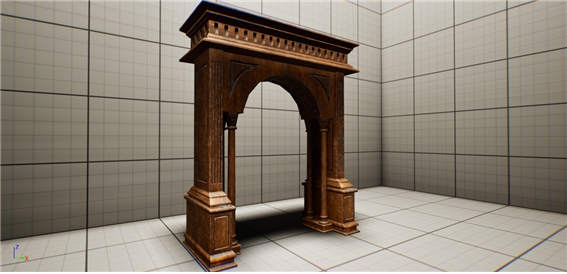
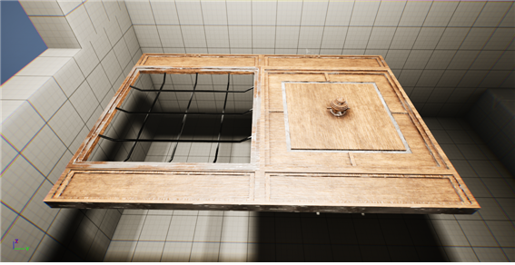
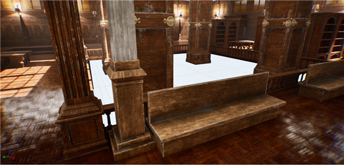

# 프로젝트명: Music Library

# [ 목차 ]
## 1. [컨셉](#1)
## 2. [관련 이미지](#2)
## 3. [대표 이미지](#3)
## 4. [컨셉과 대표 이미지 기반 작품 묘사](#4)
## 5. ["Music Library" 구성 요소](#5)
## 6. [주차별 진행상황](#6)

# [컨셉] 

## 메인컨셉 : 중세 판타지 배경

배경 모델링 컨셉 선택에 있어서 중세풍을 선택하면 창의적이고 다양한 표현을 할 수 있습니다. 그리고 취업 시 프로젝트, 선택 풀이 넓어질 수 있기 때문에 해당 컨셉으로 제작할 계획입니다. 마법과 기술이 공존하는 중세 판타지 세계관에서, 책과 음악요소를 융합한 도서관(건물 내부)을 계획했습니다.

### 책과 음악

책과 음악은 우리 삶에 풍요와 즐거움을 더해주는 두 가지 중요한 문화 형태입니다. 두 가지 모두 다양한 장점을 가지고 있으며, 서로 다른 방식으로 우리의 정신적, 감성적, 지적 성장을 촉진합니다.

책의 장점
- 상상력과 창의력 향상
- 지식과 정보 습득
- 비판적 사고 능력 향상
- 언어 능력 향상
- 스트레스 해소

음악의 장점
- 감정 표현과 해소
- 스트레스 해소
- 집중력 향상
- 기억력 향상
- 운동 효과 향상

이처럼 책과 음악은 삶에서 중요한 문화 형태입니다. 이러한 문화를 중세 판타지 풍으로 창의적이고, 아름답게 연출하고 싶습니다.

### 제작 방식

작품은 3D로 제작할 것이며, 모든 오브젝트는 직접 제작할 것입니다. 3Ds Max, ZBrush Substance Painter, Photoshop 등의 프로그램을 사용할 것이고, 언리얼 엔진5에서 루멘 라이팅과 자체적으로 설정한 PostProcessing 옵션을 추가할 것입니다.
씬 완성을 최종 목표로 삼고, 프랍 단위로 제작할 것이며, 프랍의 디테일을 최대한 끌어올리고, 실사풍 텍스처링과 엔진에서의 PBR 작업까지 진행할 것입니다.

### 프랍 & 씬 구성

프랍은 외부 자료 검색을 통해 책, 악기, 책상과 의자 등의 기본적인 사물을 여러 형태로 제작할 것입니다. 씬은 엔진 상에서 프랍들의 배치를 통해 진행할 것이며, 최대한의 디테일과 바리에이션을 넣고 싶습니다. 씬 제작이 완료된다면 적절한 캐릭터를 배치하여 맵을 돌아다닐 수 있게 설정할 계획이고, 시간이 주어진다면 오브젝트와의 상호작용 기능 또한 추가될 수 있습니다.

  

# [관련 이미지] 

- 이미지

  
  

# [대표 이미지] 

  

# 컨셉 & 대표 이미지 기반 작품 묘사 
[배경 및 요소]
1. 사실과 같은 높은 수준의 그래픽 구현
  - 하이폴 작업과 실사 사진, 메가스캔 데이터 등을 활용하여 디테일 작업 진행
2. 중세 판타지 컨셉을 참고한 책과 음악의 혼합적인 배경 구현
  - 외부 자료 탐색을 통한 아이디어 및 작업물 확보
3. 1~3인칭 시점의 유동적 카메라 시야 적용
  - 3인칭을 기본으로 특정 키 입력 또는 마우스 휠 조정을 통해 1인칭과 3인칭 변경 기능 추가 예정

  

# "Music Library" 구성 요소 

1. 이야기
[만들게 된 배경]
  저는 어렸을 때부터 3D 배경 그래픽 디자이너를 희망했습니다. 높은 수준의 그래픽 디자인을 통해 제작한 에셋들을 활용하여 다양한 게임의 배경을 연출하고 싶었습니다. 그 중에서 프랍 디자인을 가장 관심 있어 하고, 제작한 프랍들로 씬을 이루는 과정을 좋아합니다. 그래서 이번 포트폴리오로 취업에 유리한 중세 판타지 컨셉의 배경 제작을 계획하게 되었고, 세부적인 컨셉으로 책과 음악을 주제로 한 도서관을 제작할 계획입니다.

2. [카메라 관점]
  카메라는 3D 환경에서 3인칭을 기반으로, 1~3인칭의 유동적인 시점으로 적용됩니다. 배경에 캐릭터 조작을 추가하여 맵을 돌아다니면서 오브젝트들과 상호작용 하는 것 또한 구현 예정입니다.

3. 미적요소
[디자인] & [컬러]
  배경 관련된 모든 요소는 대부분 직접 제작할 예정입니다. 게임에 포함될 배경 컨셉을 미리 선정해놓았고, 해당 테마에 맞는 여러 배경 요소들을 제작하여 게임에 적용할 것인데, 이는 배경 그래픽 디자이너를 희망하는 점을 강조하는 부분이 될 것입니다. 각 오브젝트는 최대한 퀄리티를 높여서 전체적으로 실사풍의 그래픽을 구현할 것이고, 언리얼 엔진 5의 루멘 라이팅과 PostProcessing 등 고급 기술을 적용함으로써 미적 퍼포먼스를 최대한으로 끌어낼 것입니다.

4. [음향]
  무료 음원 사이트를 참고하여 기본적으로 소리가 날 수 있는 이동이나 상호작용 등의 음향과, 환경 요소에 존재하는 음악소리 등도 적용하여 영화같은 연출을 할 것입니다.

5. [기술]
  가장 중요시 되는 부분은 3DS Max, ZBrush Substance Painter, Photoshop, Speed Tree 프로그램을 이용하여 직접 배경 모델링을 진행하는 것입니다. 그리고 언리얼 엔진5에서 Procedural Foliage 기능을 통한 오픈 월드 제작 및 그에 따른 라이팅과 환경 요소 세팅을 진행할 것입니다.
  특히 미적 요소를 높이기 위해 퍼포먼스를 최대한 끌어올리면서 동시에 적절한 최적화를 진행하여 성능에 무리가 없도록 조율할 것입니다.
마지막으로 언리얼 엔진 5의 블루프린트를 이용하여 캐릭터의 이동이나 상호작용 등 애니메이션, 배경에 Npc를 추가하여 AI 시스템을 구현할 것입니다.

 

# [주차별 진행상황] 

## 1주차

- 작품계획서 작성 및 원화 수집

 

## 2주차

- 금주 계획
1. 책 모델링
2. 책 상호작용 제작(버튼을 통해 책과 상호작용하여 책이 펼쳐지고, 읽을 수 있는 기능 추가)
   
- 금주 진행 현황
1. 책 모델링, 하이폴 드로잉, 텍스쳐 작업 및 텍스쳐 모듈화 완료
2. 책받침 모델링, 하이폴 드로잉, 텍스쳐 작업 및 텍스쳐 모듈화 완료
3. ‘배럴 오르간‘ 악기 모델링 진행 중

- 차주 계획
1. ‘배럴 오르간’ 모델링, 하이폴 드로잉, 텍스쳐 작업 및 텍스쳐 모듈화 완료
2. ‘바이올린’ 악기 모델링 진행
3. 언리얼 엔진 마스터 머테리얼 제작

 

## 3주차

- 금주 계획
1. ‘배럴 오르간’ 모델링, 하이폴 드로잉, 텍스쳐 작업
2. ‘바이올린’ 악기 모델링 진행
3. 언리얼 엔진 마스터 머테리얼 제작

- 금주 진행 현황
1. ‘배럴 오르간’ 모델링, 하이폴 드로잉, 텍스쳐 작업 완료
2. ‘바이올린’ 악기 모델링 완료
3. 언리얼 엔진 마스터 머테리얼 제작 완료
   
- 차주 계획
1. 바이올린 하이폴 드로잉, 텍스쳐 작업
2. 바닥, 천장, 벽 타일링 머테리얼 제작
3. 책꽂이, 책상 모델링

 

## 4주차

- 금주 계획
1. 바이올린 하이폴 드로잉, 텍스쳐 작업
2. 바닥, 천장, 벽 타일링 머테리얼 제작
3. 책꽂이, 책상 모델링

- 금주 진행 현황
1. 바이올린 하이폴 드로잉, 텍스쳐 작업 완료
2. 바닥, 천장, 벽 타일링 머테리얼 제작 완료
3. 책꽂이, 책상 모델링 완료

- 차주 계획
1. 장식된 벽, Ceiling 등 2종 모듈화 제작

 

## 5주차

- 금주 계획
1. 장식된 벽, Ceiling 등 2종 모듈화 제작

- 금주 진행 현황
1. 장식된 벽, Ceiling, 문, 기둥 등 모듈화 프랍 6종 제작 완료

- 차주 계획
1. 계단, 난간 제작

 

## 6주차

- 금주 계획
1. 계단, 난간 제작

- 금주 진행 현황
1. 계단, 난간 제작 완료
2. 벽 추가 제작
3. 레벨 디자인 진행 중

- 차주 계획
1. 천장 장식 추가
2. 레벨 디자인 진행
- 구역 분할(여러 방)
- 용도에 따른 방
- 지형 바리에이션 추가
- 기타 증축

 

## 7주차

- 금주 계획
1. 천장 장식 모델링
2. 레벨 디자인 진행
- 구역 분할(여러 방)
- 용도에 따른 방
- 지형 바리에이션 추가
- 기타 증축

- 금주 진행 현황
1. 천장 장식 추가 및 창문 모델링
2. 레벨 디자인 진행
- 방 1개 생성
- 계단을 통한 2층 진입 구간 형성

- 차주 계획
1. 조명 애셋 모델링
2. 레벨 디자인 진행
- 조명 애셋 배치 및 라이팅

 

## 7주차

- 금주 계획
1. 천장 장식 모델링
2. 레벨 디자인 진행
- 구역 분할(여러 방)
- 용도에 따른 방
- 지형 바리에이션 추가
- 기타 증축

- 금주 진행 현황
1. 천장 장식 추가 및 창문 모델링
2. 레벨 디자인 진행
- 방 1개 생성
- 계단을 통한 2층 진입 구간 형성

- 차주 계획
1. 조명 애셋 모델링
2. 레벨 디자인 진행
- 조명 애셋 배치 및 라이팅

 

## 8주차

- 금주 계획
1. 조명 애셋 모델링
2. 레벨 디자인 진행
- 조명 애셋 배치 및 라이팅

- 금주 진행 현황
1. 조명 애셋 2종 모델링 완료
2. 레벨 디자인 진행 완료
- 조명 애셋 배치 및 라이팅

- 차주 계획
1. 중앙 대형 기둥 모델링
2. 2층 증축

 

## 9주차

- 금주 계획
1. 중앙 대형 기둥 모델링
2. 2층 증축

- 금주 진행 현황
1. 중앙 대형 기둥 모델링 완료
2. 2층 증축
1층 리모델링 및 추가 애셋 제작을 위한 계획 변경 및 진행

- 차주 계획
1. 원화를 참고하여 추가 애셋 제작(책꽂이, 가구 등)
2. 레벨 디자인(1층 구역 분배 및 추가 애셋 배치)

 

## 10주차

- 금주 계획
1. 원화를 참고하여 추가 애셋 제작(책꽂이, 가구 등)
2. 레벨 디자인(1층 구역 분배 및 추가 애셋 배치)

- 금주 진행 현황
1. 원화를 참고하여 추가 애셋 제작(책꽂이, 가구 등)
2. 레벨 디자인(1층 구역 분배 및 추가 애셋 배치)
3. God Ray 구현

- 차주 계획
1. 추가적인 가구 애셋 제작 및 배치
2. 2층 유리창 애셋 추가

 

## 11주차

- 금주 계획
1. 추가적인 가구 애셋 제작 및 배치
2. 2층 유리창 애셋 추가

- 금주 진행 현황
1. 추가적인 가구 애셋 제작 및 배치 완료
2. 유리창 애셋 추가 완료

- 차주 계획
1. 추가적인 가구 애셋 제작 및 배치(빈 구역, 안쪽 방)
2. 2층 오브젝트 배치

 

## 12주차

- 금주 계획
1. 추가적인 가구 애셋 제작 및 배치(빈 구역, 안쪽 방)
2. 2층 오브젝트 배치

- 금주 진행 현황
1. 추가적인 가구 애셋 제작 및 배치 완료(빈 구역)
2. 2층 오브젝트 배치 완료
3. 여러 재질 추가(대리석, 물, 나무)
4. 플라잉 기능 추가(작동 버튼 : N / 상승 : Space / 하강: RCtrl)
5. 시간(태양) 바뀌는 기능 추가(6분 주기)

- 차주 계획
1. 악기 모델링 : 하프(안쪽 방)
2. 위습 라이팅 추가
3. 레벨 디자인(오브젝트 배치 점검, 라이팅 보완)
4. 시네마틱 작업

 

